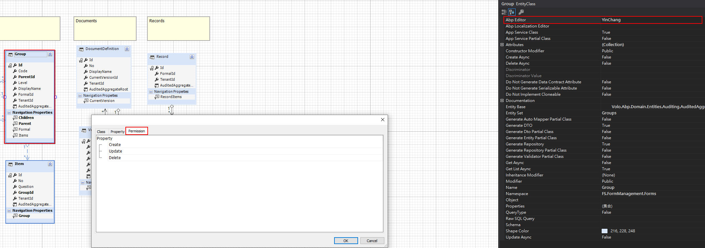
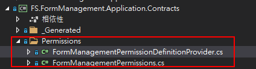
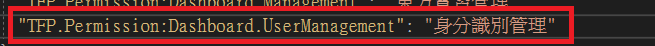
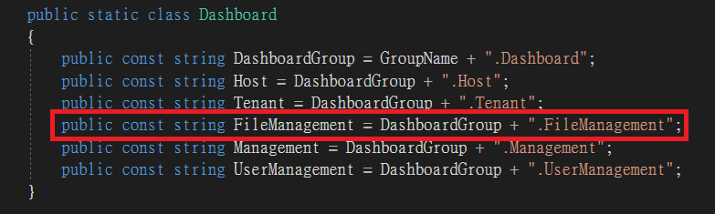
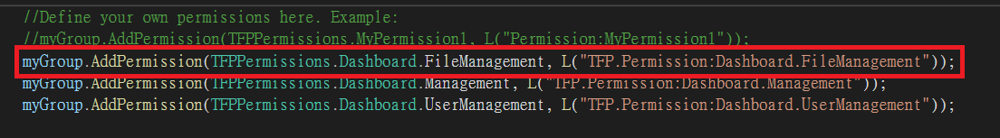
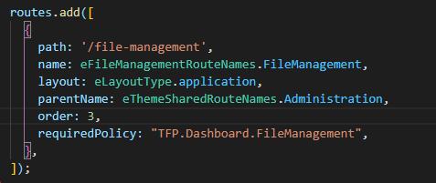
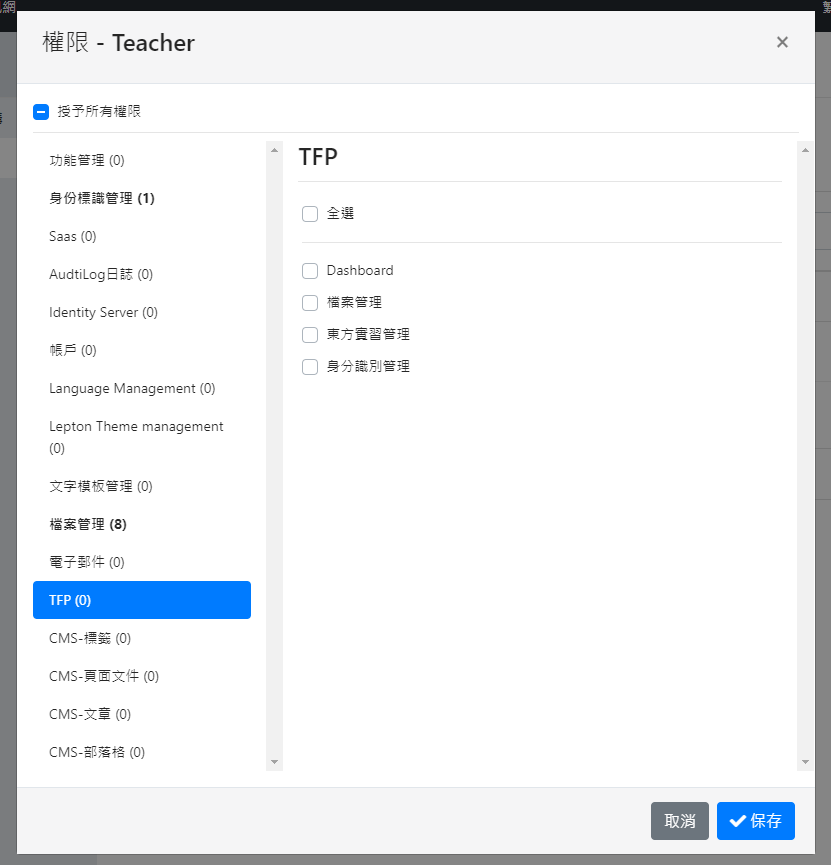

# DataModel 權限編輯器



# 手動寫入權限位置




# Step 1
於多國語言加入自訂名稱`zh-Hant.json`



# Step 2
下圖為例新增檔案管理權限，`aspnet-core\src\{ProjectName}.Application.Contracts\Permissions`



# Step 3
加入PermissionDefinitionProvider，`aspnet-core\src\{ProjectName}.Application.Contracts\Permissions`


# Step 4
angular加入requiredPolicy，`angular\libs\file-management\config\src\providers`  
　　　
  

備註:若為修改/複寫權限(如abp's identity route)
```javascript
routes.path('modulekey',{
  requiredPloicy:'Your Permission'
})
```


# 後台設定頁
管理者於後台自行設定欲顯示給使用者的頁面



