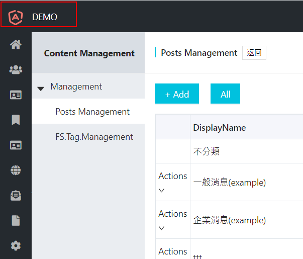

# abp's environmentService 用法
後臺介面:

此部分為讀取EnvironmentService(environment.ts)的資料


angular 注入 `environmentService` 後可取得並設定Environment值
固可在 app.component.ts就可以抽換左上角顯示文字
``` json
var env = this.environmentService.getEnvironment();
    env.application.name = test;
    env.application.logoUrl = logo.url;
    this.environmentService.setState(env);
```

備註:在Theme module完成後，就不需要此方法來設定


